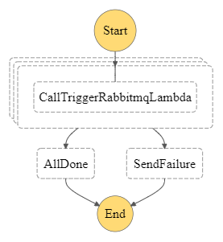

In our application, emails and other forms for communications are sent asynchronously.

### For Example.
- Emails are composed on the UI and sent from the UI, a sent flag is set to 0, to indicate that the email has not been sent.
- SMS are also composed on the UI and an entry is written into the database with the sent flag been set to 0.

For each of these interactions, The primary keys of the entities are written into a queue as well as the operations that the worker has to perform.
From the examples above
1. For emails `send.email`
2. For sms `send.sms`

These can also be generalised as `send.communications`. An example of the payload is
```json
{
	"primaryId": "123455",
	"operation": "send.communications",
	"createdBy": {identifer of the user},
	"created": {utc time stamp}
}
```
After these entries are enqueued they get processed by workers but sometimes they fail. Failed entries get written to a dead letter queue and get requeued after a ttl. 

The process of queuing and dequeuing gets repeated for x number of times until it finally fails and the entry has to be processed manually.

### Handling Failed Communications
In the application there are endpoints which can be interogated which will return a list or entities which failed. These endpoints take parameters which are used
to filter records been returned.
Here is a simplified process for handling failed communications
- Get the list of failed communications
- For each communication
- Send a payload to an api endpoint

## Step Function Implementation
According to AWS , 
>AWS Step Functions lets you coordinate multiple AWS services into serverless workflows so you can build and update apps quickly. 
>Step Functions automatically triggers and tracks each step, and retries when there are errors, so your application executes in order and as expected"

### Step Function DAG: 



The process of using step functions involves the following steps.
1. Getting the list of failed communications
2. Processing each failed communication.
3. Send a notification when the process is successful or when it fails.

**Step 1** is implemented by creating a cloud watch rule which triggers a lambda function that gets all the failed communications in a batch of 20.
The payload is then used to invoke a step function shown below in the DAG.

**Step 2** which is the step function uses a map state to trigger a call to process each failed communication. The process been triggered is a lambda function which then triggers the api.

**Step 3** uses aws sns to send a notification to an email address.


[Step Function Implementation Details ](ImplementationLambda.md)
